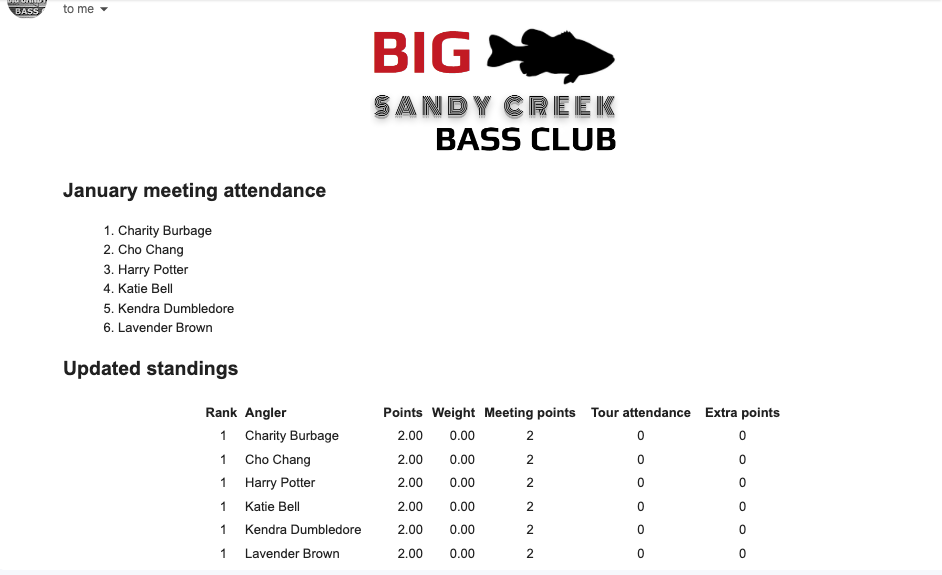

# Bass Club

## Description
I'm the secretary of the 
[Big Sandy Creek Bass Club](https://www.bigsandycreek.com/).
This Java program was designed to manage club membership
and track and communicate meeting attendance, tournament 
results, and awards.

## Requirements
1. You need a Gmail account. The account settings must be correctly configured to allow "less secure app" connectivity. [This YouTube tutorial](https://www.youtube.com/watch?v=yuT6PhH-5iw) was helpful. 
2. Your project directory must contain the following files:
   1. `EmailCredentials.txt`: a plaintext file containing only two lines: first, the Gmail username (not including the "@gmail.com"), and second, the password generated for the app (see the YouTube tutorial above). Note: this file is not included in this repository.
   2. `logo.png`: the club logo
   3. Main methods are contained in classes of the form `Season20XX.java`. In order to run this main method, there must be a corresponding `Members20XX.txt` file in the project directory. This repository will contain `Season2021.java` and thus require `Members2021.txt`. The Members file should contain comma-separated data formatted as follows: 
      1. nickname (mandatory)
      2. full name (mandatory)
      3. email (optional)
      4. phone number (optional)
      5. an * to indicate that this is a club officer (optional)
      6. an @ to add this person to a testListServe (optional)

## Usage

### Meetings
In the `main` method (in `Season20XX.java`), record attendance for a meeting
using the nicknames from `Members20XX.txt`:
```
Meeting janMeeting = new Meeting(1,
                new String[]{"cho", "charity", "katie", 
                "kendra", "harry", "lavender"});
```
Email the meeting attendance and updated club standings 
to `Angler.getTestListServe()` or `Angler.getOfficerListServe()`:
```
EmailMeetingAttendance meetingEmail = new EmailMeetingAttendance(Angler.getTestListServe(), janMeeting);
//System.out.println(meetingEmail);
meetingEmail.send();
```
The email: 

### Tournaments
In the `main` method (in `Season20XX.java`), record tournament data
using the nicknames from `Members20XX.txt`:
```
Tournament jan = new Tournament(1, "Lady Bird");

jan.weighIn("harry", 5, 5, 11.2, 0,
       "colin", 5, 5, 10.7, 0);
jan.weighIn("justin", 0, 0, 0, 0,
       "katie", 0, 0, 0, 0);
jan.weighIn("wilkie", 0, 0, 0, 0);
jan.weighIn("zacharias", 2, 2, 5.63, 0,
       "bellatrix", 0, 0, 0, 0);
jan.weighIn("cho", 0, 0, 0, 0,
       "charity", 1, 1, 4.94, 4.94);
jan.weighIn("millicent", 1, 1, 2.38, 0,
       "hannah", 0, 0, 0, 0);
jan.weighIn("cedric", 0, 0, 0, 0,
       "theodore", 1, 1, 1.19, 0);
jan.weighIn("seamus", 0, 0, 0, 0,
       "kendra", 0, 0, 0, 0);
jan.weighIn("marietta", 0, 0, 0, 0,
       "lee", 0, 0, 0, 0);

//System.out.println(jan);
```
Email the meeting attendance and updated club standings
to `Angler.getTestListServe()` or `Angler.getListServe()`:
```
EmailTournamentResults resultsEmail = new EmailTournamentResults(Angler.getTestListServe(), jan);
//System.out.println(resultsEmail);
resultsEmail.send();
```
The email: 

### Roster
In the `main` method (in `Season20XX.java`), run
```
new RosterPDF();
```
which will save a PDF containing club contact information 
to the project directory.


### Season recaps and awards
At the end of the season, run the following in the 
`main` method (in `Season20XX.java`) to email each club 
member their personalized season recaps, which also 
announces the Angler of the Year and other club 
awards.
```
// emails just one angler's recap to Angler.getTestListServe()
//EmailSeasonRecap recapEmail = new EmailSeasonRecap(Angler.getTestListServe(), "viktor");
//System.out.println(recapEmail);
//recapEmail.send();
// emails all recaps to either Angler.getTestListServe() or to each angler
EmailSeasonRecap.sendAllRecaps(false);
```
Some excerpts from a sample recap email:


## Roadmap
The next step is to automatically push AOY standings updates 
and tournament results to our [website](https://www.bigsandycreek.com/).

There is also some club interest in SMS messaging applications.

## Acknowledgements
Thanks to [rainerpm](https://github.com/rainerpm) for some help here and there.

## Project Status
This has been implemented by the club since November 2022. It is currently at 
a stopping point until I decide to tackle the new features mentioned in the Roadmap.
